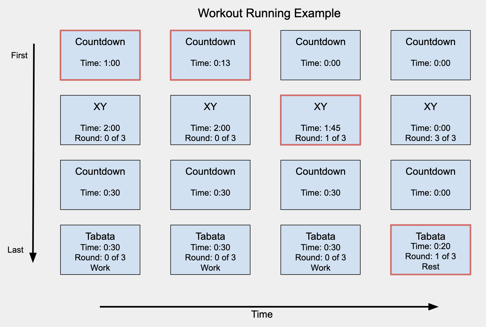

# Objective for Assignment 3

This is the 3rd and last assignment (A3) for E-39 Design Principles in React. Using our timers from Assignment 2 (A2), we will build a workout app that allows our users to assemble **multiple timers** into a workout queue. This workout queue will be executed in the order that the timers were added. Let's take a look at an example:

## Structural Changes to Context

We will have to make changes to our context in order to support the requirements for A3. In A2 we had to store the state of only one timer that we were configuring, now we will have to store all of the timers that the user has configured and the order that the timers will be executed when the user runs the workout. The order that the timers are created is the order in which they are executed.

The choice of data structure should be a queue, which follows First-In-First-Out, and supports the normal enqueue (add item to the queue) and dequeue (removes item from the queue). How you implement the queue is up to you, but things to consider are that:

1. Each timer can be in one of three states: running, completed, and not running. You will need a way to keep track of what state the timer is in, so that you can display it accordingly (see the image above) 
2. During configuration, the user can remove any timer from the queue, so you will be supporting deleting
3. While the timer is running, you will need to either store or dynamically calculate which timer is active. 
4. You don't want to clear the configurations as the timers are running. The user should be able to restart the entire workout at anytime

## Changes to Routing

Currently we have two routes `/` and `/docs`. We are going to be modifying our `/` screen and add a new one called `/add` using react-router.
### Home - Path should be `/`

- List of timers to be run for a workout. User should be able to remove a timer
- The total time the workout will take
- A button to "Add" a new timer. This button brings the user to the `/add` screen
- Controls to Pause/Resume the workout
- Controls to reset the workout back to its initial state
- Controls to "fast-forward" - ends the current running timer and moves onto the next one

### Add Timer - Path should be `/add`

- When user clicks "Add" from **Home** screen, they are routed to this page, where they can choose the type of timer and configure all inputs for each timer. After configuring, the user confirms and the timer is added to the list.
- The `/add` page should allow the user to configure any of the four timers (stopwatch, countdown, XY, and tabata)
- The user should be able to go back to the home page from here
## Installing and Running the project

As you have noticed this repository is empty. To begin this assignment you must copy over all of our files from A2 into this repo. **Do not copy over the `.git` directory and the `.gitignore` file.**. 

## Deliverable
- A user can configure (combination of any timers in any order) and execute a workout 
- All four timers must be functional: stopwatch, countdown, tabata, and XY.
- Routing must be configured to support the home route (`/`) and add route (`/add`)
- As you make modifications to your generic components, make sure to update documentation and prop-types. 

## Grading Rubric
- A workout can be configured with any combination of timers
- Final workout application should be bug free
- DRY (do not repeat yourself). Try to make sure common code is shared and not copy/pasted
- Console is free of warnings/errors
- Documentation and prop-types are defined and accurate
- Deploy your application

### Deployment Instructions (GH actions)

- Go to `Settings`
- Go to `Pages`
- in `Source`, select `gh-pages` branch
- Click Save
- In `package.json`, add a new key/value as: `"homepage": "https://prof-tejera.github.io/<repo>"`

Once the `build-deploy` action finishes running, the app should be live
at `https://prof-tejera.github.io/<repo>`

For other ways to deploy see https://github.com/prof-tejera/react-deployment-code

## Bonus

- Add full test coverage using Cypress.io. This will require that you get your tests running locally and then add a new Github action that will run the tests every time you commit to GitHub. Note that the Cypress setup is not part of this project and must be configured by you (max 8 points)
## ------------------------Added By Scarvel Harris-----------------------------------------
I have not moved the code to my test server. I will move the code tomorrow.
**_Please Note: The stopwatch applications are running in a docker environment on one of my test servers.
Source code have been checked in to the homework site._**
Open [http://74.208.183.29:3000](http://74.208.183.29:3000)

I did not have time to update the documentation from assignment. I had to redesign the code for the list of timer to run in
sync after one another. With a lot of help from Brandon I was able to complete the redesign and submit the code on time. I
also wish I had time to do some of the extra credit but I ran out of time. Assignment 3 was a lot more work than I had
anticipated.

All in all the program seem to be working. I had the bug where the when the I choose the stopwatch timer
The program works for all different timers. There is a couple of places where the update happens after the process begins. I could not figure out some of the timing issues. I don’t seem to be able to fix this problem.

When the program starts, there are three links at the top of the program
Timer - List the timers that you have chosen. If no timers are chosen, only the stopwatch button is listed.
Documentation - This is still the same as assignment 2; I did not have time to add any new documentation.
NEW LINK(Add/Configuration) - This is where you add new timers. Click dropdown ‘Stopwatch Configuration’ when you click on the stopwatch, the body of the stopwatch comes up, and you configure the times. To add the stopwatch, you click on the add button, and the list of timers you have selected appears at the bottom below the button.
To delete a stopwatch, there is a button next to each timer ‘Delete’ For some reason, sometimes it deletes right away, and sometimes once you click away and go back, it’s gone.
